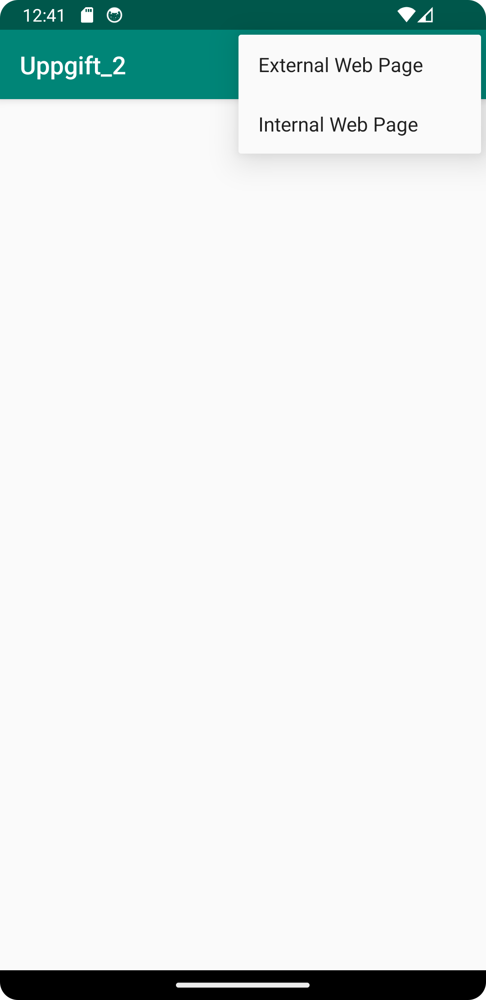
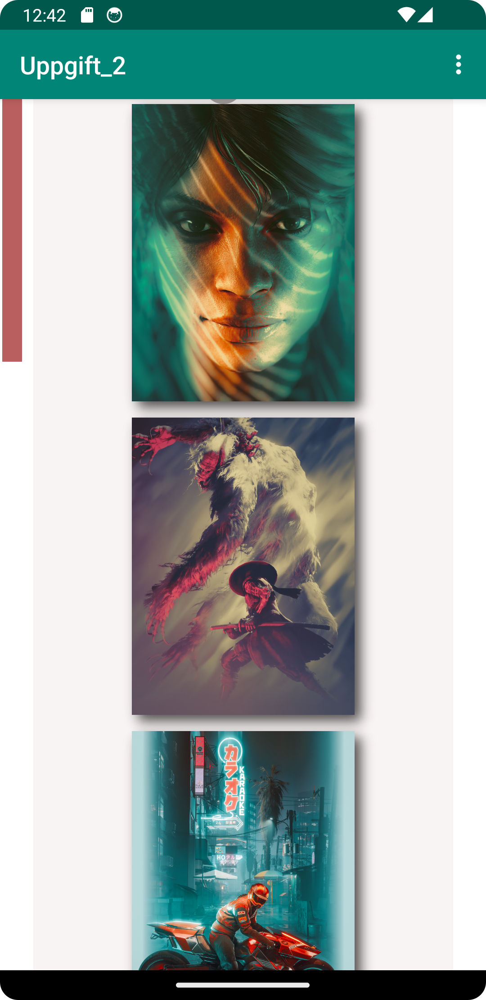
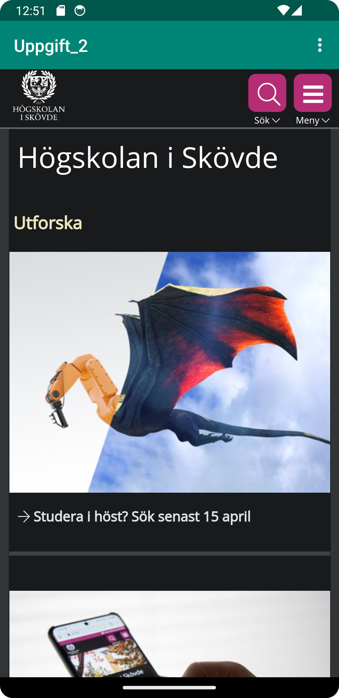

# Rapport
Jag började med att byta namn på appen till "Uppgift_2". Sedan lade jag till internetåtkomst för appen. Efter det skapade jag en WebView och gav den ID't my_WebView.
I kodexemplet nedan skapade jag en privat member variabel och instantierade den. Inuti samma kodexempel skapade jag WebViewClient samt tillät körning av JavaScript.
```
private WebView myWebView;

    @Override
    protected void onCreate(Bundle savedInstanceState) {
        super.onCreate(savedInstanceState);
        setContentView(R.layout.activity_main);
        Toolbar toolbar = findViewById(R.id.toolbar);
        setSupportActionBar(toolbar);

        myWebView = findViewById(R.id.my_WebView);
        myWebView.setWebViewClient(new WebViewClient());
        myWebView.getSettings().setJavaScriptEnabled(true);
```
Jag lade in HTML filer + bilder från en tidigare kurs. Alla bilder har relevant licensinformation inuti [info_bild](app/src/main/assets/info_bild).
Slutligen implementerade jag "showExternalWebPage()" och "showInternalWebPage" och uppdaterade menyknapparna att kalla på funktionerna.

## Bilder



